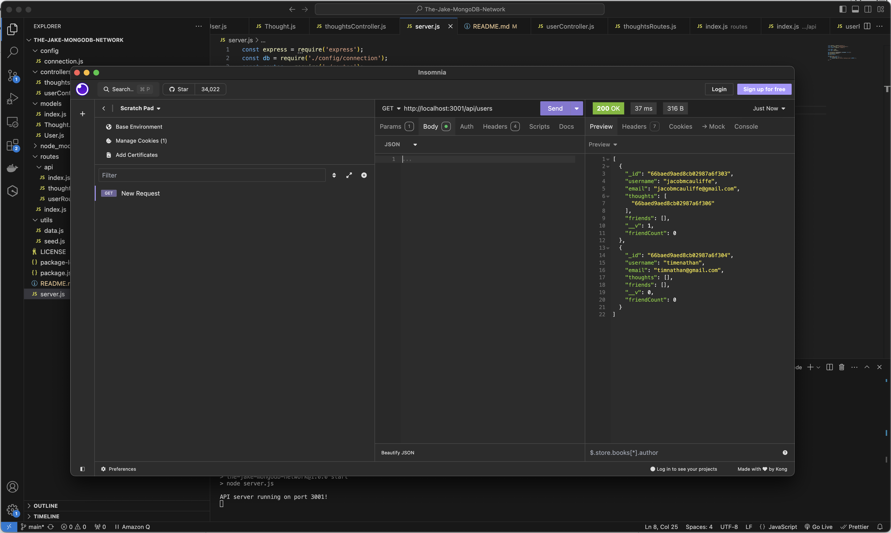

# The Jake MongoDB Network

## Table of Contents
* [Installation](#installation)
* [Description](#description)
* [Usage](#usage)
* [Contributions](#contributions)
* [License](#license)
* [Credits](#credits)
* [Tests](#tests)
* [Questions](#questions)

## Installation
To install, please clone this repository to your computer using the following steps in Github:

1. Click the "Code" dropdown menu and copy the SSH URL.
2. Open your terminal and navigate to the directory you would like to clone this repository into.
3. Type "git clone <paste SSH URL>", replacing <paste SSH URL> with your copied SSH URL. You can substitute an SSH URL with an HTTPS URL.
4. Press enter.

## Description
This is an API for a (fictional) social media company "The Jake MongoDB Network." This website allows users to to login, share their thoughts, react to friends' thoughts, and create a list of friends.

The backend itself utilizes MongoDB/Mongoose to maintain a database of users and thoughts. If a user utilizes Insomnia or a similar API client application, the user can manually add, update, or remove any users or thoughts from the database. Virtuals are used to maintain count of users' friends and thoughts.

## Usage
Enter the following commands via the terminal for server.js to ensure node is installed and your sql database is running:

npm install
psql -U postgres
\i database/schema.sql
\q
node seeds/index.js
node server.js

Once you have confirmed the server is running, the user can navigate to Insomnia or a similar program to issue GET, POST, PUT, or DELETE commands so the user can view or update the database.

GET commands can be entered to retrieve either lists of all or individual categories, products, and/or tags. Individual items can be gathered by ID.

POST commands can be entered to create new categories, products, and/or tags.

PUT commands can be entered to update existing categories, products, and/or tags by ID.

DELETE commands can be entered to remove existing categories, products, and/or tags by ID.

[Please see this video demo.](https://drive.google.com/file/d/1epV4G7HRRcVXjdrNl8SYaKI-G9-WnMLW/view?usp=drive_link) If unable to view, you can also find the video in assets/videos/screenrecording1.mov.

## Contributions
When contributing to this repository, please reach out to me via e-mail to discuss the change you would like to make first. I am open to ideas both with regards to data stored in the tables and alterations to user interaction with the data.

## License
This project is licensed under the MIT License. For more information, please see the [MIT License](https://opensource.org/licenses/MIT).

## Credits
This program was created by Jacob McAuliffe for the UC Berkeley eDX Coding Boot Camp.

## Tests
In the future, I would like to incorporate both more data within both the database and tables. There's opportunity to expand the tables into categories such as release date, items sold, or manufacturer. The tables themselves could also be expanded to include much of this new information, creating a more organized and user-friendly back-end experience.

## Questions
If you have further questions, you can reach me at [mcauliffemedia@gmail.com](mailto:mcauliffemedia@gmail.com).

GitHub Account: [jacobmca](https://github.com/jacobmca)